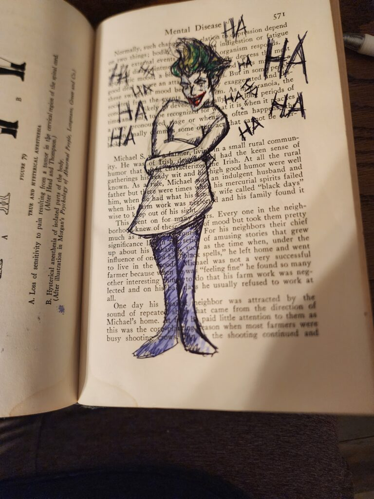
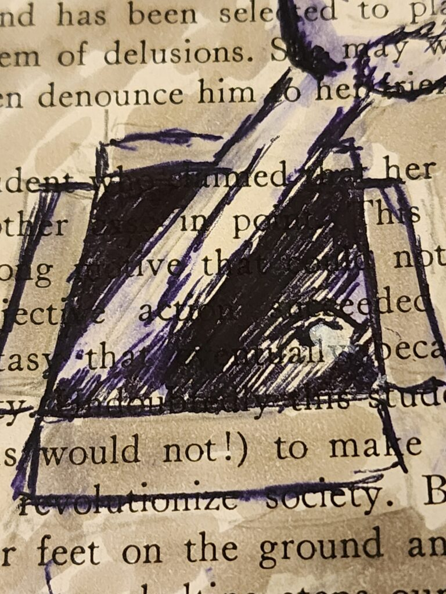
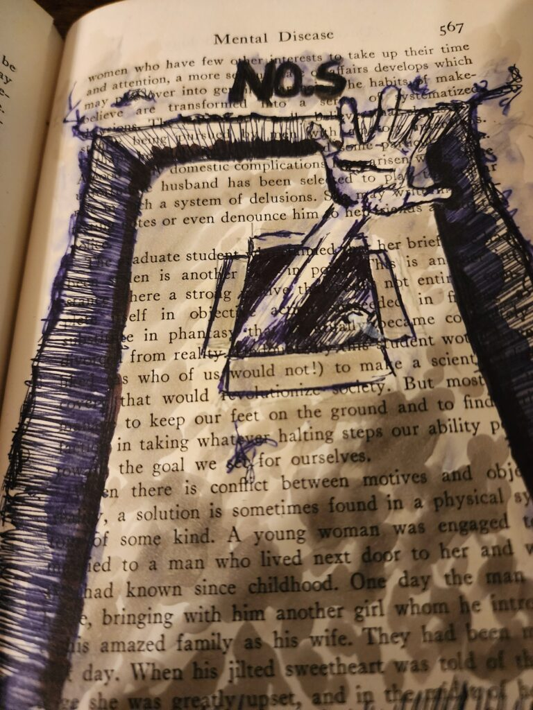
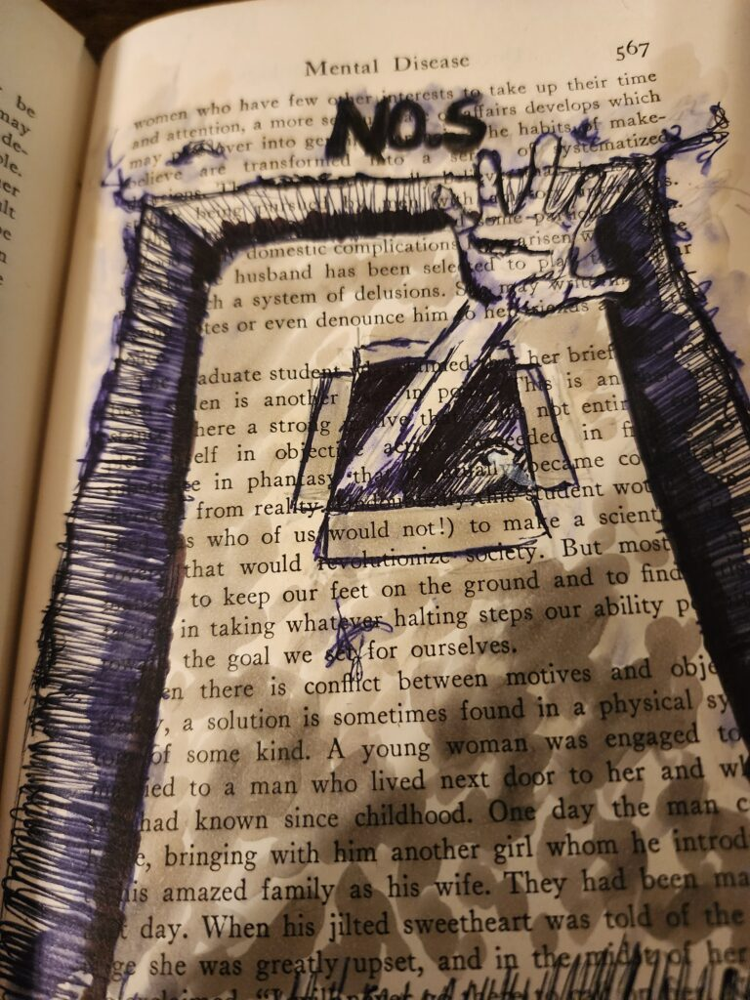
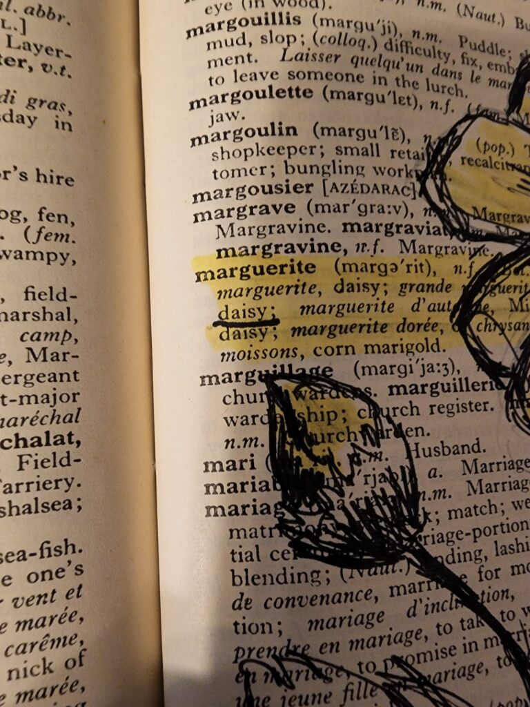
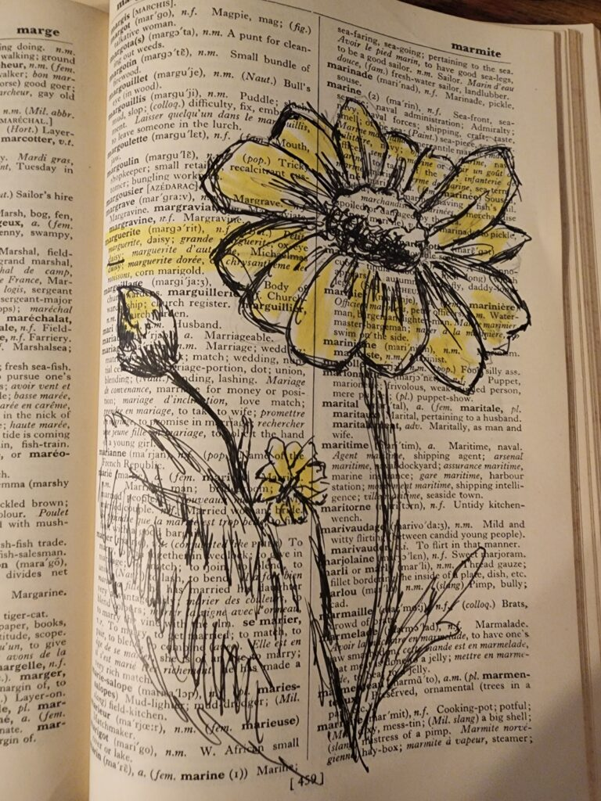
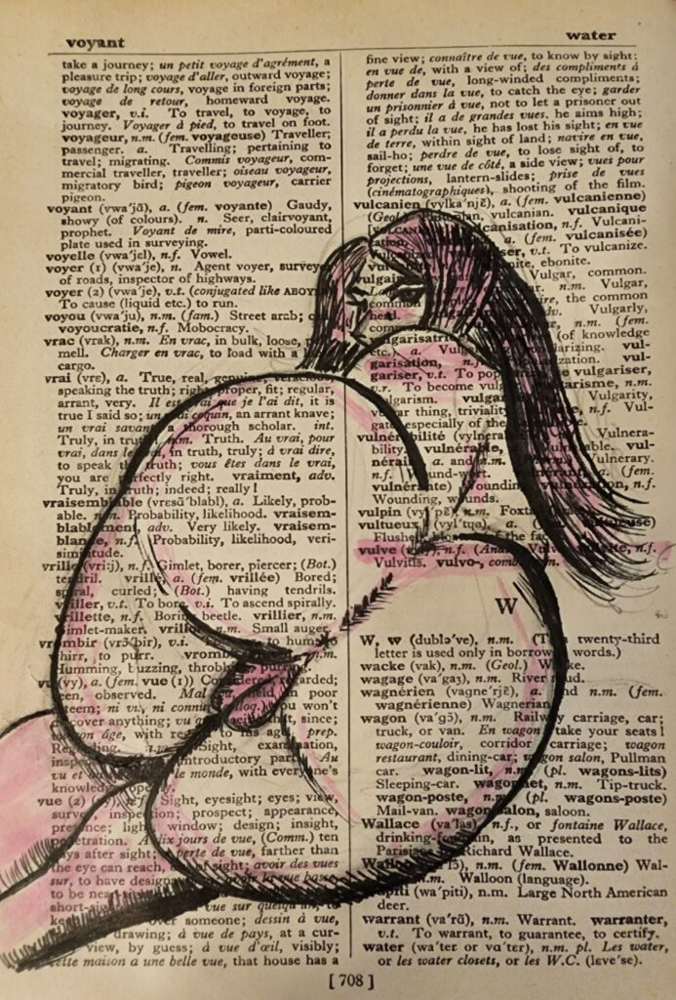

I found a bunch of raggedy old textbooks that were destined for the trash. I started using them as drawing prompts for sketch sessions. The exercise is simple:

- Open a textbook to a random page

- pick a word on that page.

- That's your prompt.

